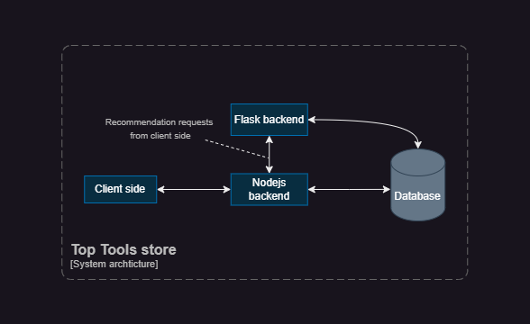

# Top Tools Store

This project was submitted as a graduation project to complete the requirements for the Bachelor's degree in Computer Systems Engineering.

## Overview

The main aim of the project was to develop an advanced online marketplace tailored for craftsmen tools and construction equipment that utilized artificial intelligence (AI) to optimize the buying and selling processes for Top Tools company.

## Objectivs

- Develop an intuitive and easy-to-use online store application.
- Reduce complexities in invoicing, inventory management, and ensure timely customer fulfillment.
- To build trust and credibility by adding features like reviews, ratings, and customer testimonials.
- Using AI to analyze user behavior and suggest relevant products for a better shopping experience.

## System Design

### Technologies:

#### Front end Technologies:

- **HTML5**, **CSS3**, and **JavaScript** formed the core.
- **Bootstrap** and **React-Bootstrap** were used for responsive design.
- **React.js** was employed for building the user interface.

#### Back End Technologies:

- **Node.js** and **Express.js** were used for server-side development.
- **Flask** was used to create an API endpoint to return recommendations related to the users.

#### Database:

- **MongoDB** was chosen for its scalability and flexibility in handling data.

### System Architecture:

## Future Improvements and Enhancements

- Mobile application expansion.
- Developing a real time chat for customer support.
- English language support.
- Enhancing the recommender system by introducing a collaborative filtering approach.

## Teamates

- [Bashar Masarwi](https://github.com/BasharMasarwi)
- [Oraib Sleet](https://github.com/oraib26)
- [Bushra Jaber](https://github.com/bushra-jaber)
